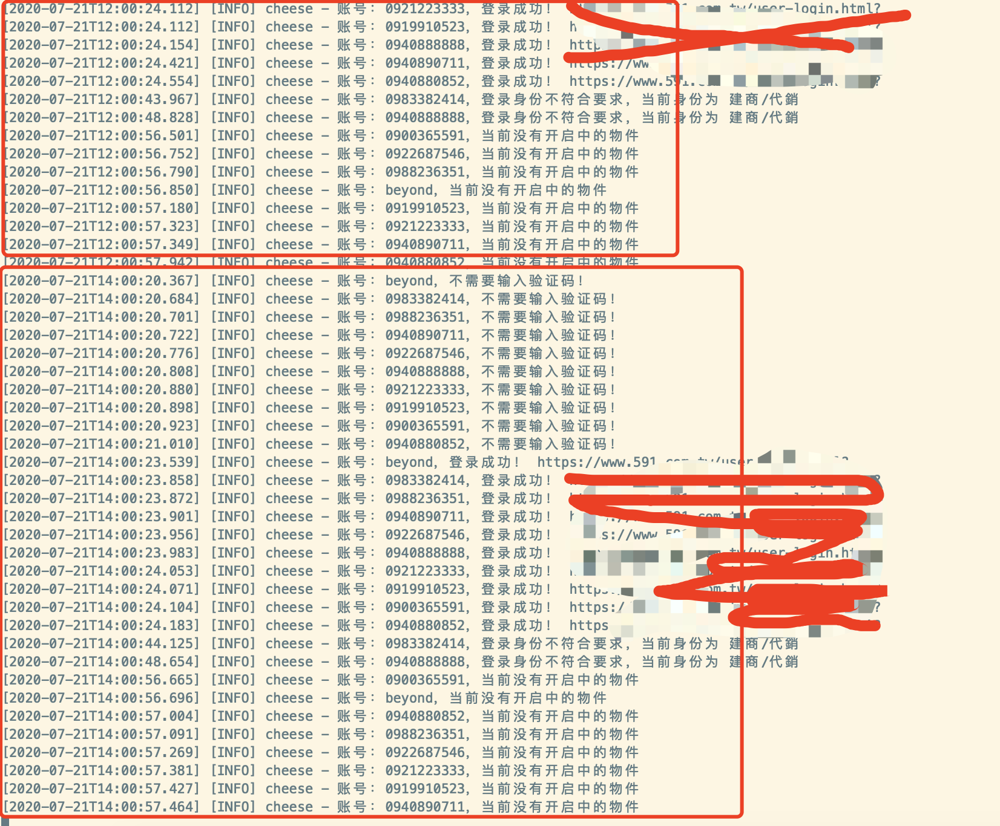

## 什么是 Puppeteer

`puppeteer` 中文意思是：操纵木偶的人、傀儡师。

本文介绍的 `puppeteer` 是 `Google Chrome` 团队出的无界面（Headless）`Chrome` 工具。它是一个 `Nodejs` 库，提供了高级 `API` 通过 [DevTools Protocol](https://chromedevtools.github.io/devtools-protocol/) 控制 `Chrome`（Chromium）。

> Headless Chrome 称为无头浏览器或者无界面浏览器，通俗的说指没有窗口的浏览器

## 可以做什么？
- 生成页面的截图和 `PDF`。
- 爬取 `SPA`（单页面应用）并生成渲染后的内容，即 `SSR`（服务端渲染）。
- 自动进行登录、表单提交、UI 测试、键盘输入等等操作。
- 监控内容或结构变化。
- 网站性能分析。

尝试一下：在线 `Puppeteer` [运行环境](https://try-puppeteer.appspot.com/)

## 安装

```shell
npm i puppeteer  // 安装 puppeteer 库
```

> 注意：安装 puppeteer 时会跟随下载一个与该 API 一起使用的 `Chromium` 最新版本 （〜170MB Mac，〜282MB Linux，〜280MB Win）。


### 跳过下载 Chromium
要跳过下载 `Chromium`，可通过 [npm config](https://docs.npmjs.com/cli/config) 添加环境变量实现。

```shell
npm config set PUPPETEER_SKIP_CHROMIUM_DOWNLOAD true
```

其他环境变量配置，可查阅[环境变量](https://github.com/puppeteer/puppeteer/blob/v5.2.0/docs/api.md#environment-variables)

配置本地 Chrome 路径

```javascript

const browser = await puppeteer.launch({
    executablePath:'/Applications/Google Chrome.app/Contents/MacOS/Google Chrome' // MacOSS
    // executablePath:'C:\\Program Files (x86)\\Google\\Chrome\\Application\\chrome.exe' // window
});

```

## 实例

### 截图

```typescript
const puppeteer = require('puppeteer');

(async () => {
  const browser = await puppeteer.launch();
  const page = await browser.newPage();
  await page.goto('https://www.591.com.tw');
  await page.screenshot({path: '591.png'});

  await browser.close();
})();
```

以上为官方标准例子，主要是启动一个浏览器，打开一个 tab 栏，在 tab 栏输入 url，接着截图，生成名为 `591.png` 的截图，最后再关闭浏览器的操作流程。

### 全尺寸截图

```typescript
const puppeteer = require('puppeteer');

(async () => {
    const browser = await puppeteer.launch();
    const page = await browser.newPage();
    await page.goto('https://www.591.com.tw');
    await page.screenshot({path: '591.png', fullPage: true});

    await browser.close();
})();

```

可以把以上代码复制进 [puppeteer 运行环境](https://try-puppeteer.appspot.com/) 中，点击 `RUN IT` 按钮，执行代码，发现虽然在结果栏有生成整个页面的截图，但滚动截图发现，有很多是空白无数据的区块，遇到这种情况怎么办呢？

> 注意：puppeteer 运行环境默认加载了 puppeteer，所以上面的代码不需要复制 `const puppeteer = require('puppeteer')`，同时也不要带上 `(async () => { ...})()`，这个异步自执行包裹函数。

### 滚动截图

```typescript
const puppeteer = require('puppeteer');

(async () => {
    const browser = await puppeteer.launch();
    const page = await browser.newPage();
    await page.goto('https://www.591.com.tw');

    await autoScroll(page); // 滚动页面

    await page.screenshot({path: '591.png', fullPage: true});

    await browser.close();
})();

async function autoScroll(page) {
    return page.evaluate(() => {
        return new Promise((resolve, reject) => {
            var totalHeight = 0;
            var distance = 100;
            var timer = setInterval(() => {
                var scrollHeight = document.body.scrollHeight;
                window.scrollBy(0, distance);
                totalHeight += distance;
                if (totalHeight >= scrollHeight) {
                    clearInterval(timer);
                    resolve();
                }
            }, 100);
        })
    });
}

```

上面我们自己写了一个 `autoScroll` 的异步方法，它可以在截图之前自动滚动页面，触发页面中的滚动监听事件，获取数据，从而能够截取到有数据的图片！

### 渲染 SPA 页面

```typescript
const puppeteer = require('puppeteer');

(async () => {
  const browser = await puppeteer.launch();
  const page = await browser.newPage();
  await page.goto('https://www.591.com.tw');
  const result = await page.content();

  console.log('result:', result)

  await browser.close();
})();
```

通过 `await page.content()` 我们就可以获取到爬取页面的完整 `html` 代码。

在我们部门，因为早期应用了 `React` 和现在使用的 `Vue`，为了满足 `SEO` 需求， 对任何一个框架应用 `SSR` 都是很耗时的工作，所以我们应用了 `Google` 的亲儿子 [Rendertron](https://github.com/GoogleChrome/rendertron) ，帮助我们渲染 `SPA` 页面。

### 登录

```javascript
const uniqueIdElement = await page.$('#user-username');
uniqueIdElement && await uniqueIdElement.type('allen yu', { delay: 20 });

const passwordElement = await page.$('#user-pwd');
passwordElement && await passwordElement.type('123456', { delay: 20 });
```

上面是登录功能的核心代码，其实很简单，就是获取到输入框，然后再输入用户名和密码，点击登录按钮即可完成。

但如果碰到图形验证码，或者滑动验证码，就会大大增加登录的复杂度，这里不会展开，有兴趣的，可以自行研究。

我在公司内部有实现一个账号监控程序，实现了对数十个测试账号，每 2 个小时，自动登录一次，查看是否有开启的物件，如果有，就会通过有度接口进行通知。

下面是部分监控日志截图，仅供参考




## 参考
- [Puppeteer 中文 API 文档](https://zhaoqize.github.io/puppeteer-api-zh_CN/)
- [国内下载安装 Puppeteer 的方法](https://brickyang.github.io/2019/01/14/%E5%9B%BD%E5%86%85%E4%B8%8B%E8%BD%BD%E5%AE%89%E8%A3%85-Puppeteer-%E7%9A%84%E6%96%B9%E6%B3%95/)